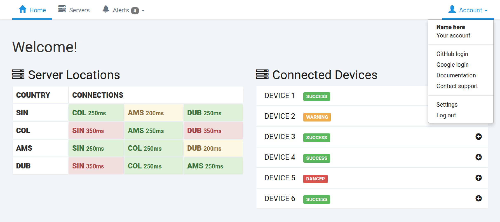

# Network Application


## Project for Python 300 course, part of UW PCE Python Programming certificate.

## Team: Ashay Krishna, Jing Dai, Mike Bozee



## Instruction to run locally:

- Clone this repo
- Activate project virtualenv, "py300_project":
```
$ source py300_project/bin/activate
```
- Run server:
```
$ cd network_site
$ python manage.py runserver
```
- View in browser at http://localhost:8000/

## Mike's Todo:

- [x] Ability to log in through GitHub/Google via allauth
- [ ] Ability to log out of allauth account(s)
- [ ] Deploy to [AWS Elastic Beanstalk](https://aws.amazon.com/elasticbeanstalk/)
- [ ] Ability to manage site account
- [x] Incorporate mock-up UI from https://github.com/mikebozee/py300-network-project
- [ ] Connect to GNS3 virtual networks
- [ ] Assess and manage sqlite db
